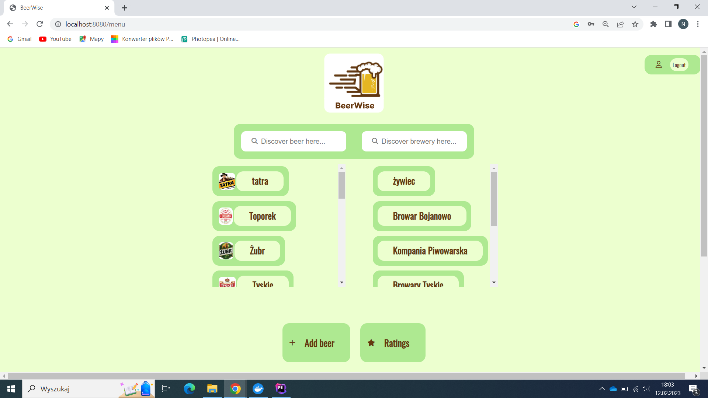
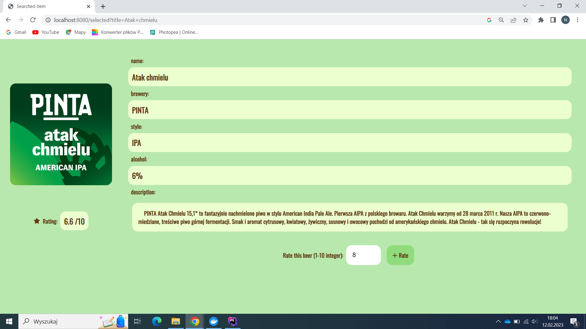
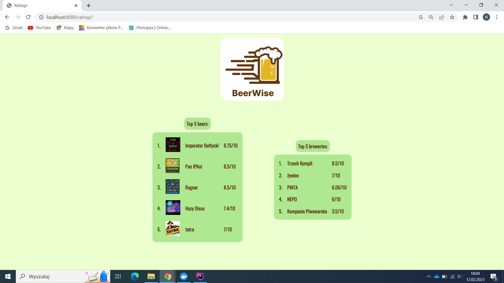

<p align="center">
    
</p>

# BeerWise

BeerWise to aplikacja internetowa, której odbiorcami są osoby interesujące się odkrywaniem i degustacją różnych rodzajów piw.

Co roku w Polsce na rynek jest wypuszczane 2400 nowych premier piwnych, spośród ponad 200 browarów.
Jak łatwo policzyć daje to około 200 piwnych premier w miesiącu.
Nie ulega wątpliwości, iż nie sposób spróbować wszystkich. Zatem z pewnością każdy chciałby spróbować tylko tych najlepszych, a raczej wystrzegać się piw mniej udanych.

Aplikacja "BeerWise" przychodzi z pomocą i pozwala dokonać najlepszego wyboru piwa.
Dysponujemy bazą piw wraz z uśrednioną wartością ocen danego egzemplarza, dokonanych przez użytkowników aplikacji.
Ponadto aplikacja udostępnia bardziej szczegółowe informacje na temat danego piwa, browaru, który je uwarzył oraz prezentuje rankingi najwyżej ocenionych.
Nie możesz odnaleźć w naszej bazie piwa, które Cię intersuje?
Możesz pomóc rozwijać aplikację dodając brakujące piwo, aby umożliwić innym użytkownikom jego ocene.






## Technologie

* HTML
* CSS
* JavaScript
* PHP
* PostgreSQL

## Wymagania

- Docker


## Instalacja

1. Sklonuj repozytorium

```
git clone https://bolivin@bitbucket.org/bolivin/pai_project.git
```
2.Stwórz plik .env z ustawieniami dostępu do bazy danych

```
DB_NAME=''
DB_USER=''
DB_PASSWORD=''
```
3. Uruchom aplikację

```
docker-compose build
docker-compose up
```
4. Aplikacja jest dostępna pod adresem http://localhost:8080


## Autor

- [@bolivin](https://bitbucket.org/bolivin/pai_project/src/master/)

